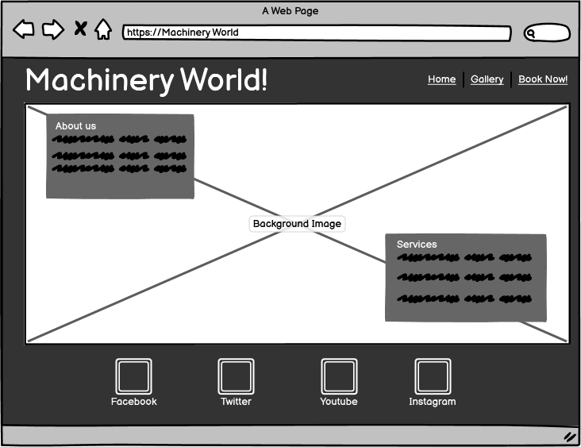
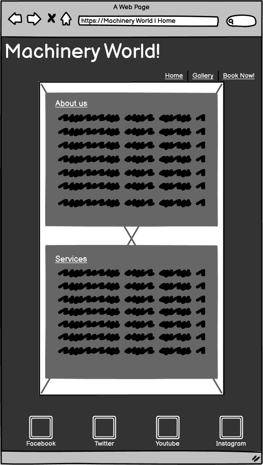
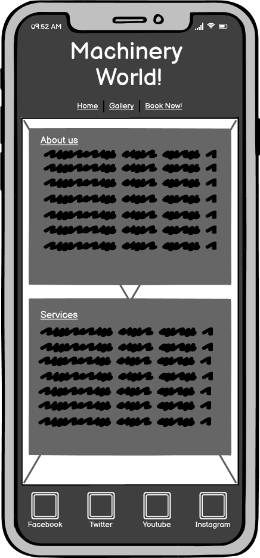
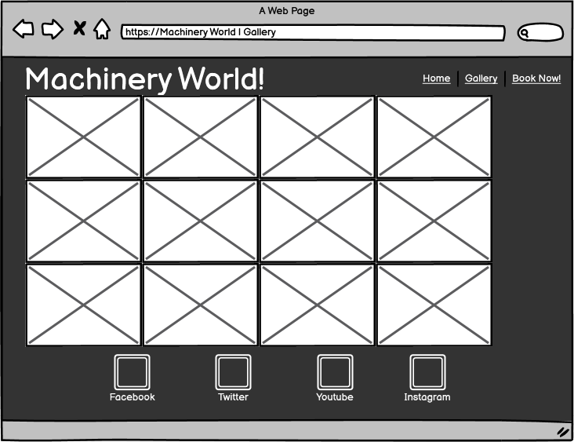
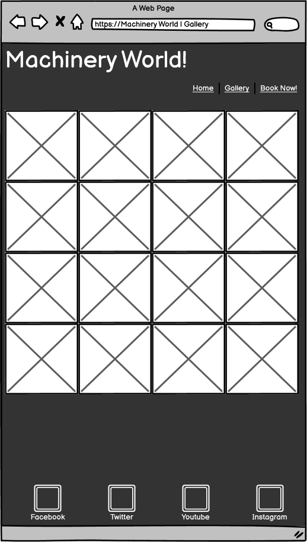
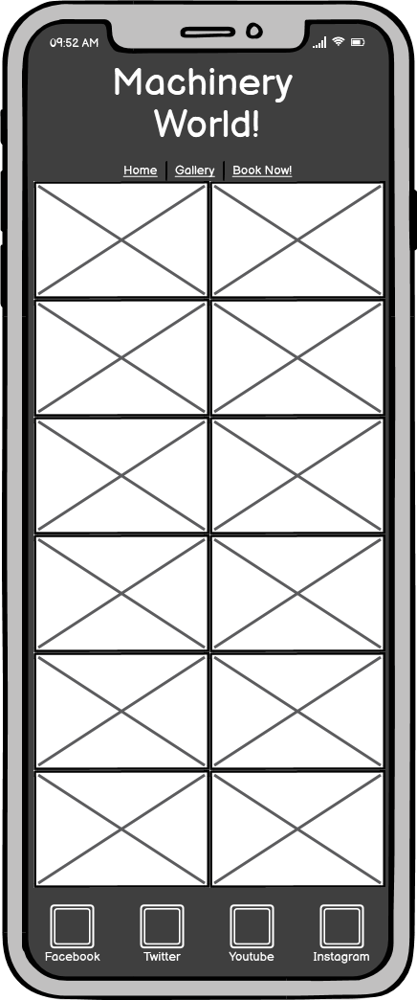
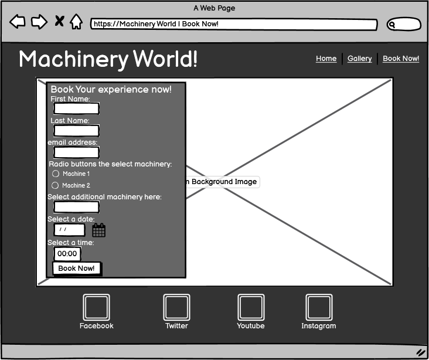
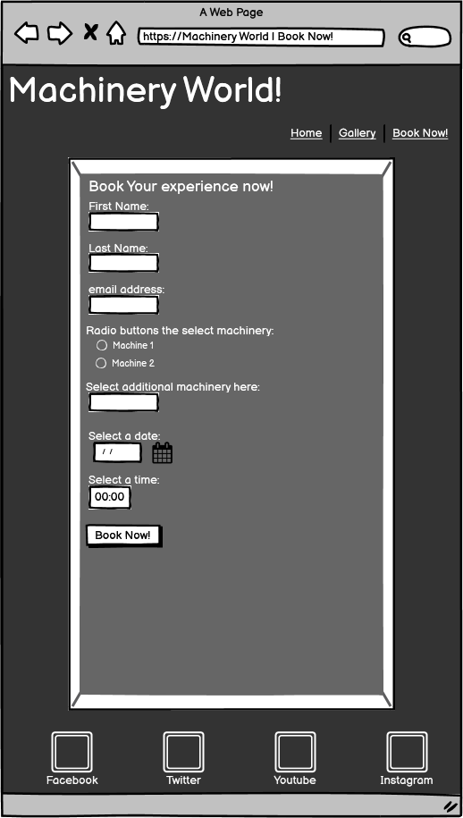
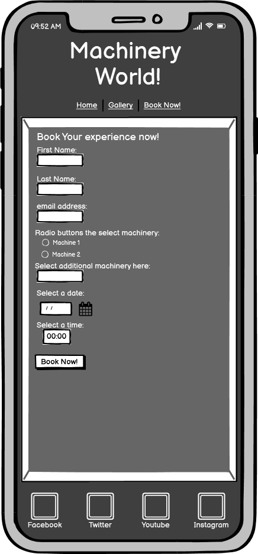
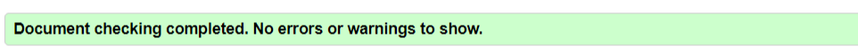

# Machinery World

<a href="https://dnolan1993.github.io/machinery_world_/index.html">Link to live project</a>

The Machinery World website is a site to advertise a fictional constructioin machinery theme park. Machinery world is a theme park where ,kids age 8 and over , and adults can experience driving any construction equipment they choose. To get a feel for what it's like to run machinery first hand. The site is mainly targeted at adults that may want a fun day out for their family or just themselves, there is a image gallery to show some of the machinery available and the applications they may experience while at the park.

Users of this website will be able to find all the information thery need to know about Machinery world: What is Machinery World, opening times,
safety procedures, contact information and a booking form. This site is targeted towards parents that think their child would enjoy the experience of driving construction equipment or that they may themselves enjoy the experience.

 
## UX
### Ideal Client
The ideal client for this page is an adult seeking a fun day for themselves/ their family.
#### They would ideally:
<ul>
    <li>Be a parent.</li>
    <li>Have disposable income to book.</li>
    <li>Live in Ireland where the theme park is located (travelling distance to the park to make a day trip)</li>
    <li>Have an interest in construction equipment or an interest in experiencing operating construction equipment</li>
</ul> 

#### Goal as a first time visitor to the site:
<ul>
    <li>Understand what machinery world is and the services the park provides.</li>
    <li>Be able to easily navigate through the site to find what they are looking for.</li>
    <li>View the site and easily navigate to and understand the booking form.</li>
</ul>

#### Goal as a returning visitor:
<ul>
    <li>Quickly be able to navigate to the section of the site you wish to view/use.</li>
    <li>Quickly be able to navigate to the booking form and book an experience.</li>
</ul>

## Design

## Wireframes
 
<ul>
    <li>
    Homepage Wireframes 
     
    
     
    
     
    
    </li>
     
    <li>
    Gallery Wireframes  
    
     
    
     
    
    </li> 
     
    <li>
    Book Now! Wireframes  
    
     
    
     
    
    </li>
</ul>

### Images
<ul>
    <li>
    All images throughout the site are of construction machinery, as it is a construction equipment based theme park. I tried to us the most eye catching pictures I could find of the machinery that would best display how the machinery operated and to catch the eye of the user.
    </li>
</ul>

### Colour Scheme
<ul>
    <li>
    For the colours of the webpage I went with a dark background and a light text colour as I felt this woould stand out to the user and as most of the images had a lighter back ground, they would stand out more to the user.
    </li>
</ul>

### Fonts

<ul>
    <li>
    For the fonts I used Google fonts. For the logo I used 'Stalinist One' as it is a big blocky font that I felt would fit well with the type of logo I wanted for the website, all other text on the site is 'Roboto' as I felt it flowed well throughout the site and is very readable for a user. 
    </li>
</ul>

## Technologies Used

<ul>
    <li>
    Google Fonts
        <ul>
            <li>
            I imported fonts from Google fonts to style the website.
            </li>
        </ul>
    </li>
</ul>
<ul>
    <li>
    Font Awesome
        <ul>
            <li>
            I imported icons from font awesome to style the website.
            </li>
        </ul>
    </li>
</ul>

### Languages Used

<ul>
<li>HTML</li>
<li>CSS</li>
</ul>

## Features
### Existing Features
<ul>
    <li>Header</li>
        <ul>
            <li>
            The Header displays a logo of the theme park and contains a navigation link for users to easier navigate the website.
            </li>
        </ul>
        <ul>
            <li>Navigation</li>
                <ul>
                    <li>
                    The navigation is featured at the top of the page to make it easy to access and is immediately visible to the user, the logo itself is a navigation link which returns to the home page which is located in the top left of the page, other navigation links are located in the top right of the page.
                    </li>
                </ul>
                
        </ul>
    <li>About us</li>
        <ul>
            <li>
            The About us section of the page gives the user a brief introduction to the company and the services it provides, outlining when the park was established and what they aim to do.
            </li>
        </ul>
        
        <li>Services</li>
        <ul>
            <li>
            The Services section of the page gives the user a brief overview of what the company does and the services we offer to the user.
            </li>
        </ul>
        
        <li>Gallery</li>
        <ul>
            <li>
            The Gallery page gives the user a selection of images of the equipment they can operate and some of the applications of the equipment.
            </li>
        </ul>
        
        <li>Book Now! Form</li>
        <ul>
            <li>
            The "Book Now!" form page gives the user a way to book an experience throught the page, they can select the type of machinery they would like to operate as well as the time and date they would like to do so. This page also has a section that the can add more machinery if they choose to do a full day experience, they can do so in the text input labelled on the page. 
            </li>
        </ul>
        
</ul>

### Possible Features to be Implemented in the future:
<ul>
    <li>
    A Contact us page with a enquiry form and all methods of contacting the business.
    </li>
    <li>
    An embeded map to show users where the theme park is.
    </li>
    <li>
    Indivual pages for each machine and the applications of each particular machine, showing user clearly what to expect from their experience and help them choose which experience suits them best.
    </li>
    <li>
    If all other possible features were implemented, the site would required an improved nav bar. Including a drop-down menu for the machinery list to navigate through those pages. 
    </li>
</ul>

## Testing

### Validator Testing
<ul>
    <li>
    <a href="https://validator.w3.org/#validate_by_input" target="_blank">HTML Validator</a>
    </li>
    <ul>
        <li>
            index.hmtl result
            
        </li>
        <li>
            gallery.hmtl result
            
        </li>
        <li>
            booknow.hmtl result
            
        </li>
    </ul>
</ul>

<ul>
    <li>
    <a href="https://jigsaw.w3.org/css-validator/#validate_by_input" target="_blank">CSS Validator</a>
    </li>
    <ul>
        <li>
            style.css result
            
        </li>
    </ul>
</ul>

<ul>
    <li>
        I tested that the site works on differrnt browsers: Chrome, Microsoft Edge, Firefox and Safari (on iPhone).
    </li>
    <li>
        I used devtools to ensure my webpage was responsive across varying screen sizes and devices. I also used devtools to ensure the site functioned in the manner I intended.
    </li>
    <li>
        I tested all links to ensure that they bring the user to the intended page and/or section of the page.
    </li>
    <li>
        I confirmed that all content of the pages were easy to read and understand for the user, with clear headings to signal to the user where the content was and what it related to.
    </li>
    <li>
        I confirmed my form functionality by running it with the correct information, then incorrect information as a control to ensure the inputs were correct and working corrrectly.
    </li>
</ul>

## Bugs
### Solved bugs
<ul>
    <li>
    When I tested the "Book Now!" form page I relised that if you use auto-fill on google chrome browsers it changed the background color of the text inputs to white, which caused an issue as the text color is also white making it invisible within the text input.
    </li>
    <li>
    I researched online to find that this is a common problem, I found an article on stackoverflow.com giving code examples to correct this error but because my text inputs are transparent I had to continue to run different variants of similar code until I found one that fixed the error. 
    </li>
    <li>
    Adding the code snipet: 
        transition: background-color 5000s ease-in-out 0s; 
    Solved the problem and the form page functioned properly again.
    </li>
</ul>

## Credits
