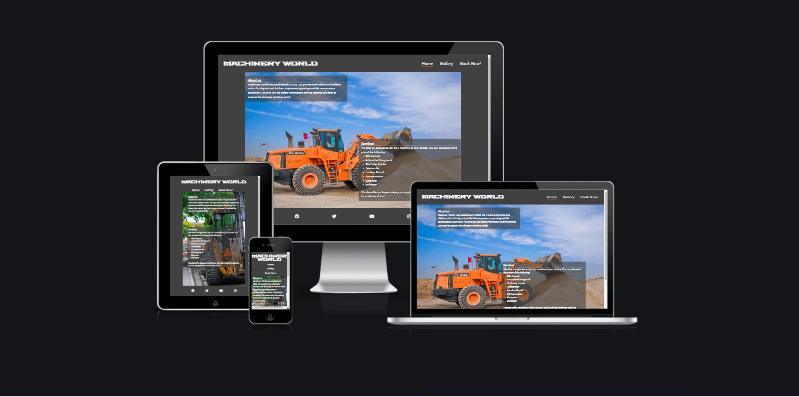
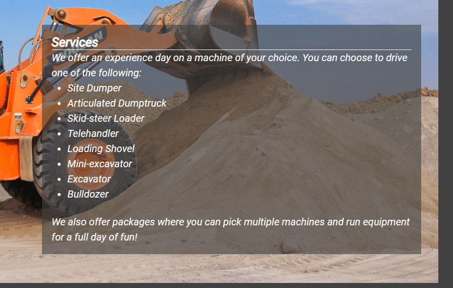
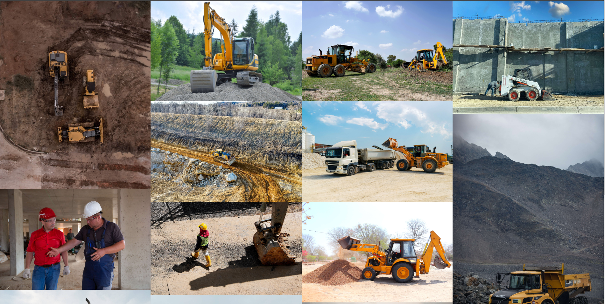
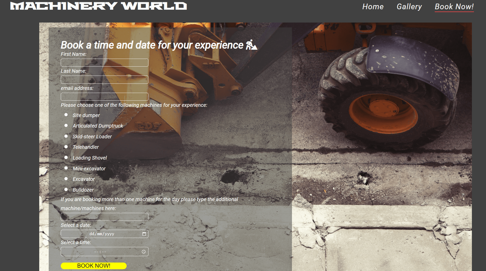

# Machinery World

<a href="https://dnolan1993.github.io/machinery_world_/index.html">Link to live project</a>

The Machinery World website is a site to advertise a fictional constructioin machinery theme park. Machinery world is a park where ,kids age 8 and over , and adults can experience driving any construction equipment they choose. To get a feel for what it's like to run machinery first hand. The site is mainly targeted at adults that may want a fun day out for their family or just themselves, there is a image gallery to show some of the machinery available and the applications they may experience while at the park.

Users of this website will be able to find all the information thery need to know about Machinery world: What is Machinery World, opening times,
safety procedures, contact information and a booking form. This site is targeted towards parents that think their child would enjoy the experience of driving construction equipment or that they may themselves enjoy the experience.

## Features
<ul>
    <li>Header</li>
        <ul>
            <li>
            The Header displays a logo of the theme park and contains a navigation link for users to easier navigate the website.
            </li>
        </ul>
        <ul>
            <li>Navigation</li>
                <ul>
                    <li>
                    The navigation is featured at the top of the page to make it easy to access and is immediately visible to the user, the logo itself is a navigation link which returns to the home page which is located in the top left of the page, other navigation links are located in the top right of the page.
                    </li>
                </ul>
                
        </ul>
    <li>About us</li>
        <ul>
            <li>
            The About us section of the page gives the user a brief introduction to the company and the services it provides, outlining when the park was established and what they aim to do.
            </li>
        </ul>
        
        <li>Services</li>
        <ul>
            <li>
            The Services section of the page gives the user a brief overview of what the company does and the services we offer to the user.
            </li>
        </ul>
        
        <li>Gallery</li>
        <ul>
            <li>
            The Gallery page gives the user a selection of images of the equipment they can operate and some of the applications of the equipment.
            </li>
        </ul>
        
        <li>Book Now! Form</li>
        <ul>
            <li>
            The "Book Now!" form page gives the user a way to book an experience throught the page, they can select the type of machinery they would like to operate as well as the time and date they would like to do so. This page also has a section that the can add more machinery if they choose to do a full day experience, they can do so in the text input labelled on the page. 
            </li>
        </ul>
        
</ul>

## Testing
<ul>
    <li>
        I tested that the site works on differrnt browsers: Chrome, Microsoft Edge, Firefox and Safari (on iPhone).
    </li>
    <li>
        I used devtools to ensure my webpage was responsive across varying screen sizes and devices. I also used devtools to ensure the site functioned in the manner I intended.
    </li>
    <li>
        I tested all links to ensure that they bring the user to the intended page and/or section of the page.
    </li>
    <li>
        I confirmed that all content of the pages were easy to read and understand for the user, with clear headings to signal to the user where the content was and what it related to.
    </li>
    <li>
        I confirmed my form functionality by running it with the correct information, then incorrect information as a control to ensure the inputs were correct and working corrrectly.
    </li>
</ul>
