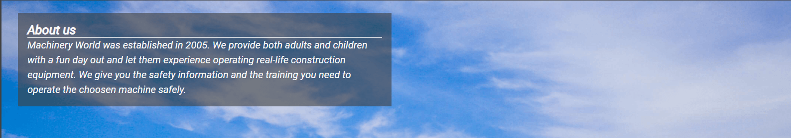

# Machinery World

<a href="https://dnolan1993.github.io/machinery_world_/index.html">Link to live project</a>

The Machinery World website is a site to advertise a fictional constructioin machinery theme park. Machinery world is a theme park where ,kids age 8 and over , and adults can experience driving any construction equipment they choose. To get a feel for what it's like to run machinery first hand. The site is mainly targeted at adults that may want a fun day out for their family or just themselves, there is a image gallery to show some of the machinery available and the applications they may experience while at the park.

Users of this website will be able to find all the information thery need to know about Machinery world: What is Machinery World, opening times,
safety procedures, contact information and a booking form. This site is targeted towards parents that think their child would enjoy the experience of driving construction equipment or that they may themselves enjoy the experience.

 
 

## UX
### Ideal Client
The ideal client for this page is an adult seeking a fun day for themselves/ their family.
#### They would ideally:
<ul>
    <li>Be a parent.</li>
    <li>Have disposable income to book.</li>
    <li>Live in Ireland where the theme park is located (travelling distance to the park to make a day trip)</li>
    <li>Have an interest in construction equipment or an interest in experiencing operating construction equipment</li>
</ul> 

#### Goal as a first time visitor to the site:
<ul>
    <li>Understand what machinery world is and the services the park provides.</li>
    <li>Be able to easily navigate through the site to find what they are looking for.</li>
    <li>View the site and easily navigate to and understand the booking form.</li>
</ul>

#### Goal as a returning visitor:
<ul>
    <li>Quickly be able to navigate to the section of the site you wish to view/use.</li>
    <li>Quickly be able to navigate to the booking form and book an experience.</li>
</ul>

 

## Design

 

## Wireframes
 
<ul>
    <li>
    Homepage Wireframes 
     
    
     
    
     
    
    </li>
     
    <li>
    Gallery Wireframes  
    
     
    
     
    
    </li> 
     
    <li>
    Book Now! Wireframes  
    
     
    
     
    
    </li>
</ul>

 

### Images
<ul>
    <li>
    All images throughout the site are of construction machinery, as it is a construction equipment based theme park. I tried to us the most eye catching pictures I could find of the machinery that would best display how the machinery operated and to catch the eye of the user.
    </li>
</ul>

 

### Colour Scheme
<ul>
    <li>
    For the colours of the webpage I went with a dark background and a light text colour as I felt this woould stand out to the user and as most of the images had a lighter back ground, they would stand out more to the user.
    </li>
</ul>

 

### Fonts

<ul>
    <li>
    For the fonts I used Google fonts. For the logo I used 'Stalinist One' as it is a big blocky font that I felt would fit well with the type of logo I wanted for the website, all other text on the site is 'Roboto' as I felt it flowed well throughout the site and is very readable for a user. 
    </li>
</ul>

 

## Technologies Used

<ul>
    <li>
    Google Fonts
        <ul>
            <li>
            I imported fonts from Google fonts to style the website.
            </li>
        </ul>
    </li>
</ul>
<ul>
    <li>
    Font Awesome
        <ul>
            <li>
            I imported icons from font awesome to style the website.
            </li>
        </ul>
    </li>
</ul>

 

### Languages Used

<ul>
<li>HTML</li>
<li>CSS</li>
</ul>

 

## Features
### Existing Features
<ul>
    <li>Header</li>
        <ul>
            <li>
            The Header displays a logo of the theme park and contains a navigation link for users to easier navigate the website.
            </li>
        </ul>
        <ul>
            <li>Navigation</li>
                <ul>
                    <li>
                    The navigation is featured at the top of the page to make it easy to access and is immediately visible to the user, the logo itself is a navigation link which returns to the home page which is located in the top left of the page, other navigation links are located in the top right of the page.
                    </li>
                </ul>
                
        </ul>
    <li>About us</li>
        <ul>
            <li>
            The About us section of the page gives the user a brief introduction to the company and the services it provides, outlining when the park was established and what they aim to do.
            </li>
        </ul>
        
        <li>Services</li>
        <ul>
            <li>
            The Services section of the page gives the user a brief overview of what the company does and the services we offer to the user.
            </li>
        </ul>
        
        <li>Gallery</li>
        <ul>
            <li>
            The Gallery page gives the user a selection of images of the equipment they can operate and some of the applications of the equipment.
            </li>
        </ul>
        
        <li>Book Now! Form</li>
        <ul>
            <li>
            The "Book Now!" form page gives the user a way to book an experience throught the page, they can select the type of machinery they would like to operate as well as the time and date they would like to do so. This page also has a section that the can add more machinery if they choose to do a full day experience, they can do so in the text input labelled on the page. 
            </li>
        </ul>
        
</ul>

 

### Possible Features to be Implemented in the future:
<ul>
    <li>
    A Contact us page with a enquiry form and all methods of contacting the business.
    </li>
    <li>
    An embeded map to show users where the theme park is.
    </li>
    <li>
    Indivual pages for each machine and the applications of each particular machine, showing user clearly what to expect from their experience and help them choose which experience suits them best.
    </li>
    <li>
    If all other possible features were implemented, the site would required an improved nav bar. Including a drop-down menu for the machinery list to navigate through those pages. 
    </li>
</ul>

 

## Testing

### Validator Testing
<ul>
    <li>
    <a href="https://validator.w3.org/#validate_by_input" target="_blank">HTML Validator</a>
    </li>
    <ul>
        <li>
            index.html result
            
        </li>
        <li>
            gallery.html result
            
        </li>
        <li>
            booknow.html result
            
        </li>
    </ul>
</ul>

<ul>
    <li>
    <a href="https://jigsaw.w3.org/css-validator/#validate_by_input" target="_blank">CSS Validator</a>
    </li>
    <ul>
        <li>
            style.css result
            
        </li>
    </ul>
</ul>

 

### Browser Testing
The site has been tested on the following browsers:
<ol>
    <li>
    Google Chrome, Version 102.0.5005.115 (Official Build) (64-bit)
    </li>
    <li>
    Firefox, Version 102.0.5005.115 (Official Build) (64-bit)
    </li>
    <li>
    Microsoft Edge, Version 102.0.1245.41 (Official build) (64-bit)
    </li>
    <li>
    Safari on iOS, version 15.4 (iPhone, iPad and iPod)(Tested on iPhone XR)
    </li>
</ol>

Additional Testing

<ul>
    <li>
        I got friends and family to visit the site on their own devices and give me feedback on the functionality of the page and the result was they could navigate the site easily on their individual devices and the all links worked.
    </li>
    <li>
        I manually tested all links to ensure that they bring the user to the intended page and/or section of the page.
    </li>
    <li>
        I Used Devtools in Google Chrome, Version 102.0.5005.115 (Official Build) (64-bit), to ensure that the elements of my page were responsive through all screen sizes and to test that links still functioned as they should.
    </li>
    <li>
        I confirmed that all content of the pages were easy to read and understand for the user, with clear headings to signal to the user where the content was and what it related to.
    </li>
    <li>
        I confirmed my form functionality by running it with the correct information, then incorrect information as a control to ensure the inputs were correct and working corrrectly.
    </li>
</ul>

### Funtionality Testing

<ul>
    <li>
        Homepage
        <ol>
            <li> Logo Homepage link
                <ul>
                    <li>
                        Go to website "Home" page in web browser.
                    </li>
                    <li>
                        Click "MACHINERY WORLD" logo in the upper left of the webpage to verify it links to the homepage of the site.
                    </li>
                    <li>
                        Use devtools to adjust screen sizes up and down to verify that the logo and its positioning are responsive. 
                    </li>
                </ul>
            <li>Nav Bar
                <ul>
                    <li>
                        Verify that the bottom border is applied to only the "Home" link, to show the is the page currently active.
                    </li>
                    <li>
                        Hover over nav bar links to ensure that the red text colour is applied to item hovered over.
                    </li>
                    <li>
                        Click on link in nav bar to ensure they lead to corresponding pages. "Home" takes you to the homepage, "Gallery" takes you to the gallery page and "Book now!" takes you to the booking form page.
                    </li>
                </ul>
            </li>
            <li>Footer social media links
                <ul>
                    <li>
                        Hover over social media links within the footer to ensure the icon colour change to red when icon is hovered over.
                    </li>
                    <li>
                        Click each social media link to verify that each link brings you to the correct page. Facebook icon takes you to Facebook homepage, Twitter icon takes you to Twitter homepage, YouTube icon takes you to YouTube homepage and Instagram icon takes you to Instagram homepage.
                    </li>
                </ul>
            </li>
            <li>Responsiveness of entire Homepage
                <ul>
                    <li>
                        Use devtools to adjust screen sizes up and down to verify that the entire homepage is responsive and looks good on all screen sizes.
                    </li>
                </ul>
            </li>
        </ol>
    </li>
     
    <li>Gallery Page
        <ol>
            <li> Logo Homepage link
                <ul>
                    <li>
                        Go to website "Home" page in web browser.
                    </li>
                    <li>
                        Click the "Gallery" link in the nav bar located in the upper right of the webpage, to load Gallery page.
                    </li>
                    <li>
                        Click "MACHINERY WORLD" logo in the upper left of the webpage to verify it links to the homepage of the site.
                    </li>
                    <li>
                        Return to "Gallery" page using the nav bar again.
                    </li>
                    <li>
                        Use devtools to adjust screen sizes up and down to verify that the logo and its positioning are responsive. 
                    </li>
                </ul>
            <li>Nav Bar
                <ul>
                    <li>
                        Verify that the bottom border is applied to only the "Gallery" link, to show the is the page currently active.
                    </li>
                    <li>
                        Repeat same test on nav bar elements as previously performed on Homepage nav bar section.
                    </li>
                </ul>
            </li>
            <li>Footer social media links
                <ul>
                    <li>
                        Repeat same test on footer elements as previously performed on Homepage footer section.
                    </li>
                </ul>
            </li>
            <li>Responsiveness of entire Gallery
                <ul>
                    <li>
                        Use devtools to adjust screen sizes up and down to verify that the entire Gallery page is responsive and looks good on all screen sizes. 
                    </li>
                    <li> 
                        Verify that rows and columns count adjusts according to screen size.
                    </li>
                </ul>
            </li>
        </ol>
    </li>
     
    <li>Book Now! Page
        <ol>
            <li> Logo Homepage link
                <ul>
                    <li>
                        Go to website "Home" page in web browser.
                    </li>
                    <li>
                        Click the "Book Now!" link in the nav bar located in the upper right of the webpage, to load Gallery page.
                    </li>
                    <li>
                        Click "MACHINERY WORLD" logo in the upper left of the webpage to verify it links to the homepage of the site.
                    </li>
                    <li>
                        Return to "Book Now!" page using the nav bar again.
                    </li>
                    <li>
                        Use devtools to adjust screen sizes up and down to verify that the logo and its positioning are responsive. 
                    </li>
                </ul>
            <li>Nav Bar
                <ul>
                    <li>
                        Verify that the bottom border is applied to only the "Book Now!" link, to show the is the page currently active.
                    </li>
                    <li>
                        Repeat same test on nav bar elements as previously performed on both Homepage and Gallery page nav bar sections.
                    </li>
                </ul>
            </li>
            <li>Booking Form Inputs
                <ol>
                    <li>First Name
                        <ul>
                            <li>
                                Click the text input box for "First Name:" and type a name to verify name is clearly visible within text box.
                            </li>
                            <li>
                                Leave "First Name:" field blank and click "BOOK NOW!" button to verify that field is required. (shows error message if not filled in)
                                
                            </li>
                        </ul>
                    </li>
                    <li>Last Name
                        <ul>
                            <li>
                                Click the text input box for "Last Name:" and type a surname name to verify name is clearly visible within text box.
                            </li>
                            <li>
                                Correctly fill in fields before but leave "Last Name:" field blank and click "BOOK NOW!" button to verify that field is required. (shows error message if not filled in)
                                 
                                
                            </li>
                        </ul>
                    </li>
                    <li>email address
                        <ul>
                            <li>
                                Click the text input box for "email address:" and type text without @ symbol and click "BOOK NOW!" button to verify entry has to be an email address. (shows error message when any other input than an email address is entered)
                                
                            </li>
                            <li>
                                Correctly fill in fields before but leave "email address:" field blank and click "BOOK NOW!" button to verify that field is required. (shows error message if not filled in)
                                 
                                
                            </li>
                        </ul>
                    </li>
                    <li>Radio Buttons
                        <ul>
                            <li>
                                Correctly fill in fields before but do not select a radio button and click "BOOK NOW!" button to verify that field is required. (shows error message if not filled in)
                                 
                                
                            </li>
                            <li>
                                Select the first radio button to ensure it highlights the button you have choosen.
                            </li>
                            <li>
                                Select the first radio button, then click the second radio button to ensure it selects the new button and overwrites the original selection.
                            </li>
                            <li>
                                Repeat previous step until radio buttons are exhuasted to ensure they all work uniformly.
                            </li>
                        </ul>
                    </li>
                    <li>Additional Machinery Selection
                        <ul>
                            <li>
                                Correctly fill in fields before but leave "multiple-machines" field blank to ensure this is an optional field. (does not show error message as is not a required field)
                            </li>
                            <li>
                                Choose the first item on the drop-down list to ensure it inserts this option in to the input field.
                            </li>
                            <li>
                                Repeat the previous step for each item in the drop-down list to ensure they all work correctly.
                            </li>
                        </ul>
                    </li>
                    <li>Date Selection
                        <ul>
                            <li>
                                Correctly fill in fields before but do not select a date and click "BOOK NOW!" button to verify that field is required. (shows error message if not filled in)
                                 
                                
                            </li>
                            <li>
                                Choose a date to ensure it does not show an error message and that the input is working correctly.
                            </li>
                        </ul>
                    </li>
                    <li>Time Selection
                        <ul>
                            <li>
                                This is a select input so it automatically displays the lowest value, correctly fil out the previous input and click "Book Now!" to ensure the "Select a time" field is working correctly.
                            </li>
                            <li>
                                Repeat the previous step for each select option in the "Select a time" field to verify they all work correctly and produce to right time when selected.
                            </li>
                        </ul>
                    </li>
                </ol>
            </li>
            <li>Footer social media links
                <ul>
                    <li>
                        Repeat same test on footer elements as previously performed on both Homepage and Gallery page footer sections.
                    </li>
                </ul>
            </li>
            <li>Responsiveness of entire Book Now! Page
                <ul>
                    <li>
                        Use devtools to adjust screen sizes up and down to verify that the entire Book Now! page is responsive and looks good on all screen sizes. 
                    </li>
                </ul>
            </li>
        </ol>
    </li>
</ul>

 

## Bugs
### Solved bugs

My mentor pointed out that on smaller screen sizes my website was creating a horizontal scroll, which I had not intended and was not ideal for the page layout.

We determined this horizontal scroll was created by an logo overflowing out of its parent element.

to solve this I reduced the font size for the logo in a media query for smaller device screen sizes.

This fixed the problem and now the site functions as intended on all screen sizes.

### Unsolved bugs

To my knowledge, there are no unsolved bugs within the site. 

 

## Lighthouse Summary results

 

## Deployment
This site is hosted by GitHub pages, deployed directly to the master branch. The deployed site will update if after new commits are made, they are pushed to GitHub pages using the "git push" command in the terminal. The Homepage is named index.html to ensure it deploys correctly through GitHib pages.

To deploy the site to GitHub pages I took the following steps:
<ol>
    <li>
        I logged in to Github.
    </li>
    <li>
        I selected "dnolan1993/machinery_world_" from my repositories.
    </li>
    <li>
        I selected "Settings", to the right hand side of the nav bar.
    </li>
    <li>
        I selected "Pages", lower left on the screen.
    </li>
    <li>
        I selected "Main" in the branch dropdown menu, within the "Source" section.
    </li>
    <li>
        I refreshed my page using "ctrl+shift+r" to perform a hard reload of the GitHub web page.
    </li>
    <li>
        GitHib pages then display a page with a banner stating "Your site is published at https://dnolan1993.github.io/machinery_world_/"
        
    </li>
</ol>

 

## Credits

<ul>
    <li>
    All images used in this site are stock images sourced from <a href="https://www.pexels.com/">pexels.com</a>
    </li>
</ul>

### index.html
<ul>
    <li>
    I used the code for the footer element from the Code institute practice project "Love Running"
    </li>
</ul>

### gallery.html
<ul>
    <li>
    I used the code for the footer element from the Code institute practice project "Love Running"
    </li>
    <li>
    I also used the code for styling the gallery page in a masonary layout from the Code institute practice project "Love Running"
    </li>
</ul>

### booknow.html
<ul>
    <li>
    I used the code for the footer element from the Code institute practice project "Love Running"
    </li>
</ul>